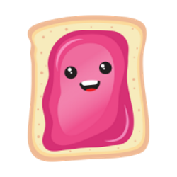

# Phaser 3 Jam Template

A [Phaser 3](https://phaser.io/) Jam Template with [TypeScript](https://www.typescriptlang.org/), [MatterJS](https://brm.io/matter-js/) and [Webpack](https://webpack.js.org/)

<div align="center">



</div>
<div align="center">
  


[](https://sonarcloud.io/dashboard?id=n00begon_phaser-jam-template)
[](https://codebeat.co/projects/github-com-n00begon-phaser-jam-template-master)


</div>

[Phaser](https://github.com/photonstorm/phaser) is a great framework to do your game jam in, giving you an easily sharable HTML5 game while having the power to make your ideas a reality. Kick off your game jam well by being all ready to go with this template. The goal is to let you focus on your game and have all the plumbing you need sorted out. Typescript, code quality, building for itch, various input methods, examples, bootloader, preloader, main game, end screen, credits screen and license screen. Try out the [live game](https://n00begon.com/games/toasty/) to see what you will start with. See the recent updates in the [change log](CHANGELOG.md)

# Getting Started

Once you have the template you need to install the dependencies.

```bash
npm install
```

While you are developing have an auto updating local server

```bash
npm run start
```

When you are ready to submit, creating a final production build in `dist`. This also creates a zip archive in `itch` to upload directly.

```bash
npm run build
```

Head over to [phaser.io/learn](https://phaser.io/learn) for tutorials and code examples

# Features

This framework has been designed to give you all the pieces you need to get started on your idea and grow with you through the game jam. It also has some extra helpers that you might not normally have time to implement.

## Input

Implementing multiple ways of input for your game is always a challenge under pressure. In the `ControlManager` you can see how keyboard, mouse, touch and gamepad controls have been abstracted out into actions for the game objects to take advantage of.

## Loading

Use the bootloader to quickly get your game logo on the screen then watch as the loading bar displays while it loads your spritesheets, audio, fonts and json into the game.

## Builds

The builds for the project are controlled by [Webpack](https://webpack.js.org/). The dev build from `npm run start` runs locally with no additional webserver required. It hot reloads your changes so you can try out your ideas quickly. When you are ready to submit `npm run build` creates a dist directory with everything you need. It also creates a `game.zip` in the itch directory for you to upload straight to [itch.io](https://itch.io/docs/creators/html5).

## Code Quality

To help keep your code clean and working through the jam there are some tools to help avoid the last day spaghetti mess.

[eslint](https://eslint.org/) will keep your Typescript correct and [Prettier](https://prettier.io/) will keep it consistent.

To use Prettier and ESLint to auto fix in VSCode, install the [ESLint extension](https://marketplace.visualstudio.com/items?itemName=dbaeumer.vscode-eslint) in the Extensions tab and add the following lines to .vscode/settings.json:

```
"editor.codeActionsOnSave": {
    "source.fixAll.eslint": true
}
```

[jest](https://jestjs.io/) is there to help you to test any tricky algorithms and [husky](https://typicode.github.io/husky/) will make sure you don't end up committing a broken project at an inopportune moment.

## Scaling

The game and end screens are built with different screen sizes in mind. For the text based screens, lay out your text on your main monitor and it will resize it to the user's device while still using your display text.

# Layout

The code is designed to give you all the pieces you need to give your game jam game a solid structure to build from. This is often something that you don't have time to architect during the jam but will pay off as you come to the end and can still safely modify your code.

## assets

Contains everything for the artist and sound designer. The spritesheets are created with [TexturePacker](https://www.codeandweb.com/texturepacker). The JSON folder holds the physics shapes for custom objects which are created with [PhysicsEditor](https://www.codeandweb.com/physicseditor).

## dist

Is where the build output goes. This has all the final files and everything you need to deploy your game.

## itch

Will contain a single `game.zip` for you to upload to [itch.io](https://itch.io/docs/creators/html5).

## src

Contains the source code. It is broken up by scene

### preloader

The Bootloader and Preloader get all your assets into the game. It has a loading bar and examples for loading Sprite Sheets, Audio, JSON and Fonts.

### main

The Main Scene is the core game loop. The objects holds the interactive game objects and there are a number of managers to keep the various parts of your code clean as it grows. There is also a UI Scene which overlays text on top of the game.

### instructions, end, credits, license

These scenes are text based for you to tell your player how to play, wrap up the game, credit the developers and meet your licensing requirements.

### utilities

The extra utilities are game settings and some examples of different types of display text.

## web

Contains the webpage layout and the favicons.

## webpack

Has the development and production configuration for the builds.

# Contributing

Feel free to submit issues for problems your find or features you would like to see. Create a pull request for something that you implemented during the jam that you wish was in the template.

# Credits

## Images

Toasty created for this project by [Jaclyn Kim](https://www.fiverr.com/jaclynkim). Additional imagery from [Kenney](https://www.kenney.nl/assets)

## Music

Arpent from [freepd.com](https://freepd.com/electronic.php) by [Kevin MacLeod](https://incompetech.com/)

## Inspired by

[Phaser 3 Project Template](https://github.com/photonstorm/phaser3-project-template) and
[Phaser 3 TypeScript/Webpack Project Template](https://github.com/wtravO/phaser3-typescript-template)

# License

[The MIT License (MIT)](LICENSE)

<div align="center">


</div>
